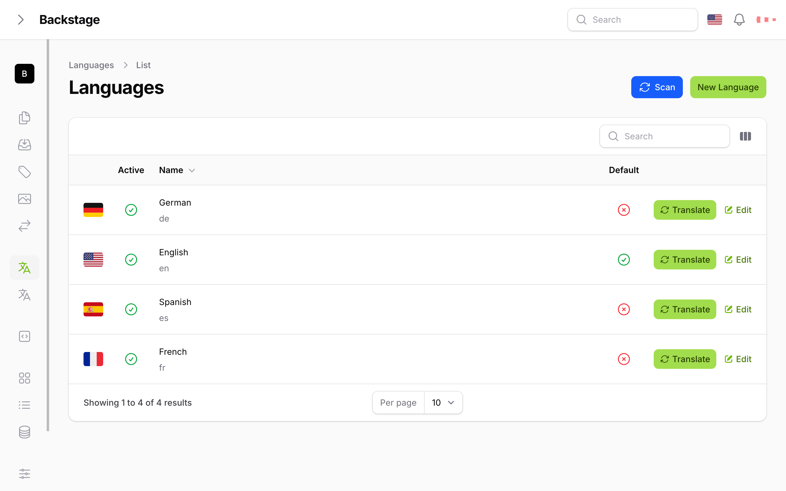

# Image Specifications

## Screenshot Format

All screenshots in this documentation are captured using the following specifications:

### Device Simulation
- **Device**: Nest Hub Max
- **Resolution**: 1280 x 800 pixels
- **Zoom Level**: 100%
- **Network Throttling**: None
- **Save-Data**: Default

### Browser Settings
- Screenshots are taken using browser developer tools
- Device simulation mode enabled
- No additional throttling or restrictions applied

### Image Quality
- High resolution for clarity
- Consistent formatting across all screenshots
- Optimized for web display

## File Organization

Images are organized in the following structure:

```
img/
└── filament/
    └── resources/
        ├── languages/
        │   ├── languages_overview.png
        │   ├── languages_overview_language_switched.png
        │   └── languages_overview_switcher_example.png
        └── translations/
            ├── translations_overview.png
            └── translations_overview_scanning.png
```

## Usage in Documentation

Images are referenced using relative paths from the documentation files:

```markdown

```

## Consistency

All screenshots maintain:
- Same device dimensions
- Consistent UI state
- Clear, readable text
- Proper contrast and visibility
