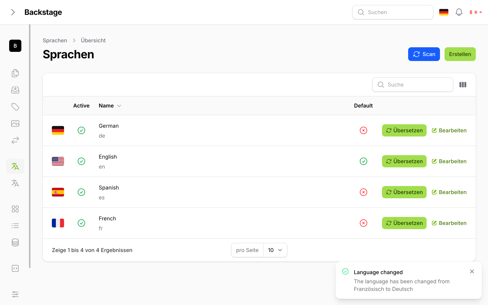

# Usage

## Basic Workflow

1. **Add languages**
```bash
php artisan translations:languages:add en English

php artisan translations:languages:add es Spanish
```

2. **Scan for translations**
```bash
php artisan translations:scan
```

3. **Translate strings**
```bash
php artisan translations:translate
```

4. **Manage in admin panel**
- Edit translations
- Switch languages
- Import/export



## Troubleshooting

**Translations not appearing?**
- Run `php artisan translations:scan`
- Check if language is active

**Translation not working?**
- Check translation provider config
- Verify API keys
- Check queue is running
